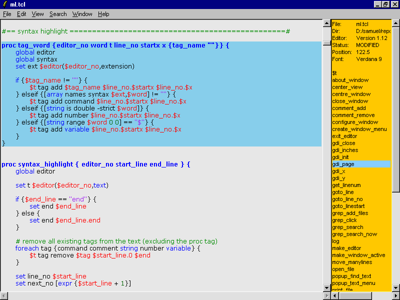

# ML-editor
GUI-editor for Tcl development. Intendet target OS is Windows95 but it
should work in any platform with Tcl/Tk ~ 8.0 or better.

# Featuring
- Auto-indent
- Comment/Uncomment
- Syntax highlight (disabled for now, can do with some shortcut)
- Procedure window
- Right click on a word to have word copied to find-window
- Editor can be invoked with file names on the command line, including wildcards
- Brace matching - highlight matching braces, also quotes and square brackets
- Find in files

# Launching
In ml-directory, enter either:
- tclsh main.tcl
- wish main.tcl
Currently don't know how to make this a starkit and not wanting to put binaries to version conrol.

And it should launch. Font can currently be changed only manually by editing configuration file.
Edit it after first exit. Tcl/Tk can be getted from [here](https://www.bawt.tcl3d.org/download.html#tclpure)
If can install from app repository or compile oneself, do so.

